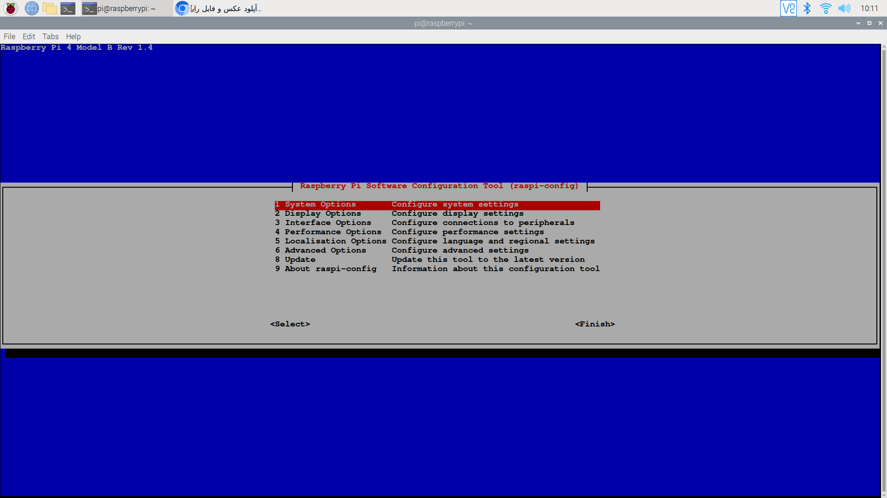
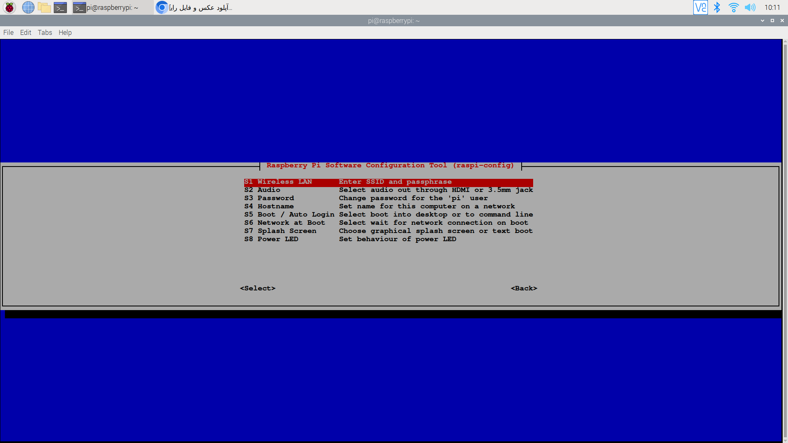
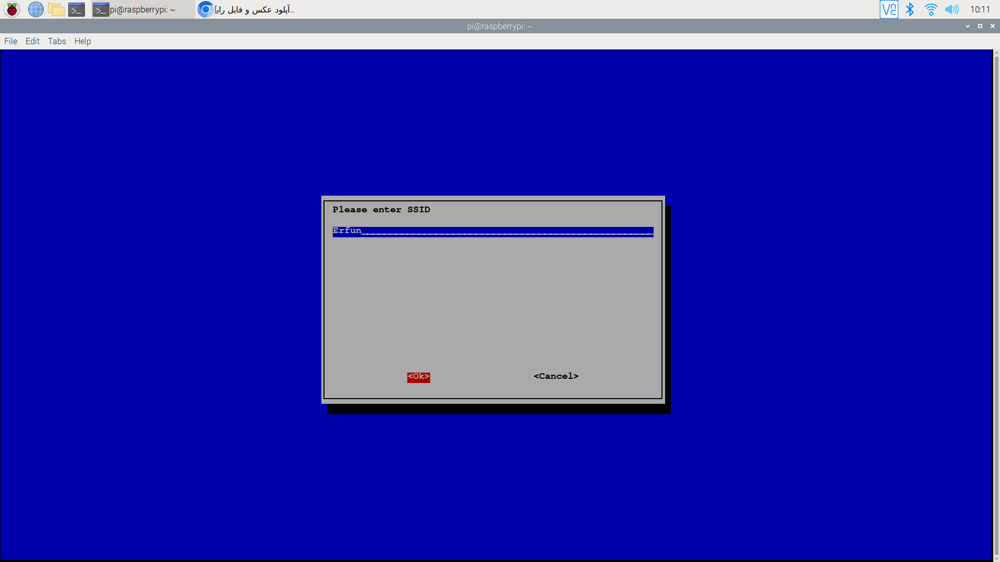
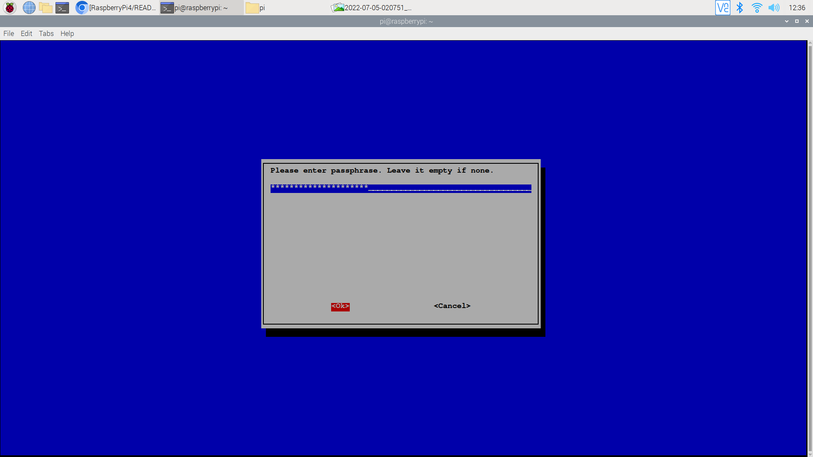
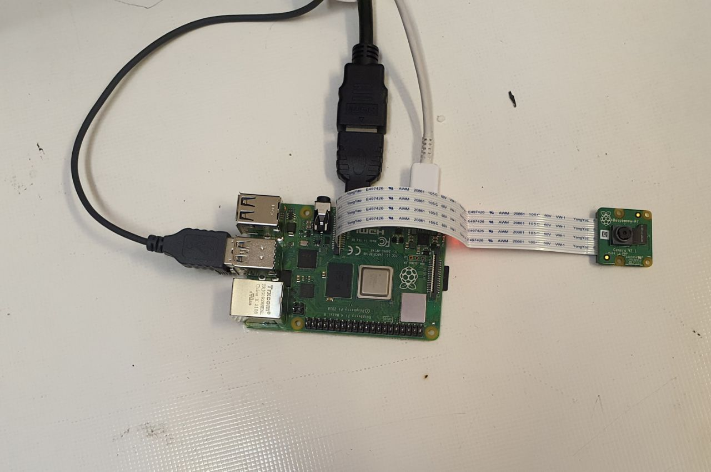

# Raspberry Pi 4 
## Pouya Shamshiri - Erfan Baghaei

This is a tutorial Project. We will learn how to start working with **Raspberry Pi 4**.


# Set up the firmware

- First of all we downloaded Raspberry pi Imager app from [here](https://www.raspberrypi.com/software/).
- We installed Rasbian OS (32-bit) on a 32GB SD card and put into our Raspberry Pi.
- We did not have a monitor at first. So we needed to [set up the device headless](https://www.tomshardware.com/reviews/raspberry-pi-headless-setup-how-to,6028.html) :
	> 1. We Wrote an empty text file named **"ssh"**  to the root of the directory of the card. When it sees the "ssh" on its first boot-up, Raspberry Pi OS will automatically enable SSH (Secure Socket Shell), which will allow us to remotely access the Pi command line from our PC.
	> 2. We need to connect our PC to the Raspberry Pi  but we didn't have an Ethernet port on our PC. So we decided to connect via WiFi. To setup a Wi-Fi connection on our headless Raspberry Pi, we created a text file called wpa_supplicant.conf, and placed it in the root directory of the microSD card. Then we wrote the following text in the file.
	

    
	```
		country=IR
		ctrl_interface=DIR=/var/run/wpa_supplicant GROUP=netdev
		update_config=1

		network={
		scan_ssid=1
		ssid="wifi_ssid"
		psk="wifi_password"
		}
	```
	> 	P.S :  	We used our mobile hotspot as WiFi network so we saw the Raspberry Pi's IP and connected to the device using this command on Windows Terminal.
	```
		ssh pi@(IP)
	```
- Now we have access to Raspberry Pi Terminal via SSH.
- Then we needed a graphical interface so we enabled VNC.
	> 1. We [downloaded](https://www.realvnc.com/en/connect/download/viewer/) VNC viewer on our Windows PC.
	> 2. We enabled VNC Server on Raspberry Pi following [this](https://www.tomshardware.com/reviews/raspberry-pi-headless-setup-how-to,6028.html).


# Drive Wifi and BLE

## WiFi
- To connect to a new WiFi network we used following commands in Terminal.
	```
	sudo raspi-config
	```
- After using the command above this window openned and then we chose "System Options"
 


- Here we chose "Wireless LAN"



-Then we should enter the name of our WIFI



- And at the end we should enter the password of WIFI



## BLE
- To connect Bluetooth devices, we use **bluetoothctl**. we used these commands form [here](https://www.digikey.com/en/maker/blogs/raspberry-pi-wi-fi-bluetooth-setup-how-to-configure-your-pi-4-model-b-3-model-b). 
	 > 1. Run the Bluetooth program by typing bluetoothctl.
	> 2. Turn on the Bluetooth, if not already on, by typing power on.
	> 3. Enter device discovery mode with scan on command if device is not yet listed in devices.
	>	4. Turn the agent on with agent on.
	>5. Enter pair MAC Address to do the pairing between devices.
	> 6. You may be prompted to enter a passcode on the Bluetooth keyboard; if so, type this on the keyboard and press enter.
	> 7. You will need to add the device to a list of trusted devices with trust MAC Address.
	> 8. Finally, connect to your device with connect MAC Address. 


# Set up the Camera 

- For setting up the V2 Camera we use [following commands](https://raspberrytips.com/install-camera-raspberry-pi/).
	> 1. Before using the camera on our Raspberry Pi, we need to enable it in our system. The camera port is disabled by default.
	> 2. Start the raspi-config tool:
		```
		$ sudo raspi-config
		```
		> 3. Go to “Interface options” > “Camera”
		> 4. “Would you like the camera interface to be enabled?”   - Yes
		> 5.  Exit raspi-config and accept the reboot
- Now we can connect the V2 Camera to our Raspberry Pi and start working with it.
- When we enabled camera interface on Raspberry Pi, the **VNC server did not respond** anymore. So we continued on a monitor and connected it to our device using micro HDMI cable.
-  To test the camera we used [following commands](https://roboticsbackend.com/raspberry-pi-camera-take-picture/) to take a picture :
	```
	$ cd ~/Pictures/
	$ raspistill -o first_image.jpg
	```
- This is our first picture on Raspberry pi :)


	

# Set up Python and C++
We want to run Python and Cpp codes on our Raspberry Pi. 
## [Python](https://roboticsbackend.com/raspberry-pi-run-python-script-in-the-terminal/)
###  Run Python code directly on the terminal
- Before we even begin to write and execute complete files, you can just run any Python command you want directly on the terminal – in what we call a “Python shell”.
- Open a terminal, and run “python3” without any argument.
	```
	$ python3
	Python 3.7.3 (default, 13:03:44)
	[GCC 8.3.0] on linux
	Type "help", "copyright", "credits" or "license"  for more information.
	>>>
	```
- This is what you should get at the end : “>>>”. 
 This means that you’re in a Python shell, inside your “terminal shell”. Now, all the commands you’ll write will be interpreted as Python commands.
	 ```
	 >>>  print("Hello")
	Hello
	>>> a = 2
	>>>  print(a)
	2
	>>>  import os
	>>>
	```
-	As you can see, we can even create variables and use them later. Now, how to quit this shell? To close the shell, you’ll have to execute the command “exit()” – with the parenthesis.
	```
	>>> exit()
	pi@raspberrypi:~ $
	```
###  Write a Python program inside the terminal
- To do that, we’ll need to use a text editor.
- On Raspberry Pi OS and most other operating systems, we can easily find and use the Nano text editor. When we open a file with Nano, no new window will be open. We’ll just write some text in the terminal, and then save the file if we want to.
- To create and write a new Python script with Nano:
	>  1. Open a terminal.
	>  2. Use
		  ```$ nano filename.py``` on an existing file or just give a new file name (you can save it later).
	> 3. Write your Python code.
	> 4.    Press CTRL+S to save the file.
	> 5. press CTRL+X to exit Nano and come back to the terminal.
	
	#### Run a Python script in the terminal of your Raspberry Pi
- All right, now that you have a Python script saved into a file, it’s time to run it directly from the terminal.

- Simply use “python3” + the name of the file:
	```
	$ python3 filename.py
	```

# [C++](https://raspberrytips.com/use-c-on-raspberry-pi/)

### First try: Hello world
-   Create a new file (with Nano).
-   Copy and paste this source code.
	```cpp
	#include <iostream>
	using namespace std;

	int main()
	{
	   cout << "Hello you" << endl;
	   return 0;
	}
	```
-   Save the file (hello.cpp for example).
- C/C++ requires pre-compilation, you can do it with this command.
	```
	$ g++ -o hello hello.cpp
	```
- Then we can run our program with:
	```
	$  ./hello
	```
- If everything works as expected, it should just display “Hello you”
	
- Hello World
- 
# Setting up [Edge Impulse](https://www.edgeimpulse.com/about)

