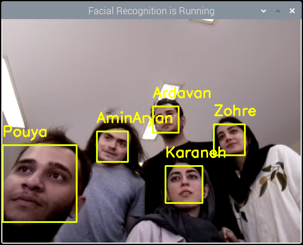

# Raspberry Pi 4 
## Pouya Shamshiri - Erfan Baghaei

This is a tutorial Project. We will learn how to start working with **Raspberry Pi 4**.


# Set up the firmware

- First of all we downloaded Raspberry Pi Imager app from [here](https://www.raspberrypi.com/software/).
- We installed Rasbian OS (32-bit) on a 32GB SD card and put into our Raspberry Pi.
- We did not have a monitor at first. So we needed to [set up the device headless](https://www.tomshardware.com/reviews/raspberry-pi-headless-setup-how-to,6028.html) :
	> 1. We Wrote an empty text file named **"ssh"**  to the root of the directory of the card. When it sees the "ssh" on its first boot-up, Raspberry Pi OS will automatically enable SSH (Secure Socket Shell), which will allow us to remotely access the Pi command line from our PC.
	> 2. We need to connect our PC to the Raspberry Pi  but we didn't have an Ethernet port on our PC. So we decided to connect via WiFi. To setup a Wi-Fi connection on our headless Raspberry Pi, we created a text file called wpa_supplicant.conf, and placed it in the root directory of the microSD card. Then we wrote the following text in the file.
	

    
	```
		country=IR
		ctrl_interface=DIR=/var/run/wpa_supplicant GROUP=netdev
		update_config=1

		network={
		scan_ssid=1
		ssid="wifi_ssid"
		psk="wifi_password"
		}
	```
	> 	P.S :  	We used our mobile hotspot as WiFi network so we saw the Raspberry Pi's IP and connected to the device using this command on Windows Terminal.
	```
		ssh pi@(IP)
	```
- Now we have access to Raspberry Pi Terminal via SSH.
- Then we needed a graphical interface so we enabled VNC.
	> 1. We [downloaded](https://www.realvnc.com/en/connect/download/viewer/) VNC viewer on our Windows PC.
	> 2. We enabled VNC Server on Raspberry Pi following [this](https://www.tomshardware.com/reviews/raspberry-pi-headless-setup-how-to,6028.html).


# Drive Wifi and BLE

## WiFi
- To connect to a new WiFi network we used following commands in Terminal.
	```
	sudo raspi-config
	```
- After using the command above this window openned and then we chose "System Options"
 


- Here we chose "Wireless LAN"


-Then we should enter the name of our WIFI


- And at the end we should enter the password of WIFI


## BLE
- To connect Bluetooth devices, we use **bluetoothctl**. we used these commands form [here](https://www.digikey.com/en/maker/blogs/raspberry-pi-wi-fi-bluetooth-setup-how-to-configure-your-pi-4-model-b-3-model-b). 
	 > 1. Run the Bluetooth program by typing bluetoothctl.
	> 2. Turn on the Bluetooth, if not already on, by typing power on.
	> 3. Enter device discovery mode with scan on command if device is not yet listed in devices.
	>	4. Turn the agent on with agent on.
	>5. Enter pair MAC Address to do the pairing between devices.
	> 6. You may be prompted to enter a passcode on the Bluetooth keyboard; if so, type this on the keyboard and press enter.
	> 7. You will need to add the device to a list of trusted devices with trust MAC Address.
	> 8. Finally, connect to your device with connect MAC Address. 


# Set up the Camera 

- For setting up the V2 Camera we use [following commands](https://raspberrytips.com/install-camera-raspberry-pi/).
	> 1. Before using the camera on our Raspberry Pi, we need to enable it in our system. The camera port is disabled by default.
	> 2. Start the raspi-config tool:
		```
		$ sudo raspi-config
		```
		> 3. Go to “Interface options” > “Camera”
		> 4. “Would you like the camera interface to be enabled?”   - Yes
		> 5.  Exit raspi-config and accept the reboot
- Now we can connect the V2 Camera to our Raspberry Pi and start working with it.
- When we enabled camera interface on Raspberry Pi, the **VNC server did not respond** anymore. So we continued on a monitor and connected it to our device using micro HDMI cable.
-  To test the camera we used [following commands](https://roboticsbackend.com/raspberry-pi-camera-take-picture/) to take a picture :
	```
	$ cd ~/Pictures/
	$ raspistill -o first_image.jpg
	```
- This is our first picture on Raspberry pi :)


	

# Set up Python and C++
We want to run Python and Cpp codes on our Raspberry Pi. 
## [Python](https://roboticsbackend.com/raspberry-pi-run-python-script-in-the-terminal/)
###  Run Python code directly on the terminal
- Before we even begin to write and execute complete files, you can just run any Python command you want directly on the terminal – in what we call a “Python shell”.
- Open a terminal, and run “python3” without any argument.
	```
	$ python3
	Python 3.7.3 (default, 13:03:44)
	[GCC 8.3.0] on linux
	Type "help", "copyright", "credits" or "license"  for more information.
	>>>
	```
- This is what you should get at the end : “>>>”. 
 This means that you’re in a Python shell, inside your “terminal shell”. Now, all the commands you’ll write will be interpreted as Python commands.
	 ```
	 >>>  print("Hello")
	Hello
	>>> a = 2
	>>>  print(a)
	2
	>>>  import os
	>>>
	```
-	As you can see, we can even create variables and use them later. Now, how to quit this shell? To close the shell, you’ll have to execute the command “exit()” – with the parenthesis.
	```
	>>> exit()
	pi@raspberrypi:~ $
	```
###  Write a Python program inside the terminal
- To do that, we’ll need to use a text editor.
- On Raspberry Pi OS and most other operating systems, we can easily find and use the Nano text editor. When we open a file with Nano, no new window will be open. We’ll just write some text in the terminal, and then save the file if we want to.
- To create and write a new Python script with Nano:
	>  1. Open a terminal.
	>  2. Use
		  ```$ nano filename.py``` on an existing file or just give a new file name (you can save it later).
	> 3. Write your Python code.
	> 4.    Press CTRL+S to save the file.
	> 5. press CTRL+X to exit Nano and come back to the terminal.
	
	#### Run a Python script in the terminal of your Raspberry Pi
- All right, now that you have a Python script saved into a file, it’s time to run it directly from the terminal.

- Simply use “python3” + the name of the file:
	```
	$ python3 filename.py
	```

# [C++](https://raspberrytips.com/use-c-on-raspberry-pi/)

### First try: Hello world
-   Create a new file (with Nano).
-   Copy and paste this source code.
	```cpp
	#include <iostream>
	using namespace std;

	int main()
	{
	   cout << "Hello you" << endl;
	   return 0;
	}
	```
-   Save the file (hello.cpp for example).
- C/C++ requires pre-compilation, you can do it with this command.
	```
	$ g++ -o hello hello.cpp
	```
- Then we can run our program with:
	```
	$  ./hello
	```
- If everything works as expected, it should just display “Hello you”
	
- Hello World

- If everything works as expected, it should just display “Hello you”
	
# Face Recognition
Now we are ready to implement a [face recognition app](https://www.tomshardware.com/how-to/raspberry-pi-facial-recognition).
## How does the Raspberry Pi Facial Recognition project work?
For Raspberry Pi facial recognition, we’ll utilize [OpenCV](https://opencv.org/), [face_recognition](https://pypi.org/project/face-recognition/), and [imutils](https://pypi.org/project/imutils/) packages to train our Raspberry Pi based on a set of images that we collect and provide as our **dataset**. We’ll run **train_model.py** to analyze the images in our **dataset** and create a mapping between names and faces in the file, **encodings.pickle**.
After we finish training our Pi, we’ll run **facial_req.py** to detect and identify faces.


## What We’ll Need for Raspberry Pi Facial Recognition

-   Raspberry Pi 3 or 4. (Raspberry Pi Zero W is not recommended for this project.)
-   Power supply/microSD/Keyboard/Mouse/Monitor/HDMI Cable (for your Raspberry Pi)
-   Raspberry Pi Camera V2 or USB Webcam

## Part 1: Install Dependencies for Raspberry Pi Facial Recognition
In this step, we will install [OpenCV](https://opencv.org/), [face_recognition](https://pypi.org/project/face-recognition/), [imutils](https://pypi.org/project/imutils/), and temporarily modify our swapfile to prepare our Raspberry Pi for machine learning and facial recognition.
-   [**OpenCV**](https://opencv.org/about/)  is an open source software library for processing real-time image and video with machine learning capabilities.
-   We will use the  **Python** [**face_recognition**](https://pypi.org/project/face-recognition/)  package to compute the bounding box around each face, compute facial embedding, and compare faces in the encoding dataset.
-   [**Imutils**](https://pypi.org/project/imutils/)  is a series of convenience functions to expedite OpenCV computing on the Raspberry Pi.

Now we are ready to start installing these dependencies.

#### Step 1 : Connecting Camera
1. Enable **Camera** from our Raspberry Pi configuration. Press **OK** and reboot your Pi.
2. Connect V2 Camera to the Raspberry Pi.
3. From our terminal we should install Pi Camera with the command:
	```
	$ pip install picamera[array]
	```
#### Step 2 : [Install OpenCV](https://singleboardbytes.com/647/install-opencv-raspberry-pi-4.htm)
first we should install OpenCV dependencies.
- To get started, we should ensure update our system by executing the commands below:
	```
	$ sudo apt update
	$ sudo apt upgrade
	```
- Next, we will install the _CMake_ developer tool necessary for building OpenCV. Execute the command below:
	```
	$ sudo apt install build-essential cmake pkg-config
	```
- We will also install additional libraries for opening image files on our computer. That includes JPG, JPEG, PNG, et. Execute the command below:
	```
	$ sudo apt install libjpeg-dev libtiff5-dev libjasper-dev libpng-dev
	```
- Other than images, we also need libraries that will enable the use of video files. Install these libraries with the commands below:
	```
	$ sudo apt install libavcodec-dev libavformat-dev libswscale-dev libv4l-dev 
	$ sudo apt install libxvidcore-dev libx264-dev
	```
- Now we have both images and videos sorted out. To display images on our computer screens and even develop Graphical User Interfaces (GUI) for our projects, we will need a module called _highgui_. That will require us to install all the necessary GTK libraries. Execute the commands below:
	```
	$ sudo apt install libfontconfig1-dev libcairo2-dev
	$ sudo apt install libgdk-pixbuf2.0-dev libpango1.0-dev
	$ sudo apt install libgtk2.0-dev libgtk-3-dev
	```
- For carrying out matrix operations, we will need to install additional dependencies. Execute the command below.
	```
	$ sudo apt install libatlas-base-dev gfortran
	```
- Now we should install the additional libraries below necessary for HD5 datasets and the development of QT GUIs. Execute the commands below:
	```
	$ sudo apt install libhdf5-dev libhdf5-serial-dev libhdf5-103
	$ sudo apt install libqt5gui5 libqt5webkit5 libqt5test5 python3-pyqt5
	```
- Lastly, we will need to install Python 3 header files necessary for compiling OpenCV. Execute the commands below:
	```
	$ sudo apt install python3-dev
	```
- Virtual environments are beneficial as they create an isolated environment for running your Python projects. Therefore, every project in a virtual environment has its own set of dependencies and libraries regardless of the libraries available for other projects.

- To get started installing a virtual environment on our Raspberry, we will first need to install pip. Execute the commands below to install pip.
	```
	$ sudo apt-get install python3-pip
	```
- With pip installed, we can now proceed to install _virtualenv_ and _virtualenvwrapper_. These are great packages that you can use to manage your virtual environments in Python. Execute the commands below.
	```
	$ sudo pip3 install virtualenv virtualenvwrapper
	```
-	Once the installation completes, we will need to edit the `.bashrc` file and point to the locations of the _virtualenv_ and _virtualenvwrapper_. Execute the command below to open the .bashrc file with the nano editor.
	```
	$ nano ~/.bashrc
	```
- Add the following lines at the bottom of the file.
	```
	# virtualenv and virtualenvwrapper
	export WORKON_HOME=$HOME/.virtualenvs
	export VIRTUALENVWRAPPER_PYTHON=/usr/bin/python3
	source /usr/local/bin/virtualenvwrapper.sh
	```
- Save the file (Ctrl + O, then Enter) and Exit (Ctrl + X). You will need to refresh the .bashrc file to apply the changes. Execute the command below.
	```
	$ source ~/.bashrc
	```
- Wou can now install OpenCV. Execute the command below.
	```
	$ pip3 install opencv-python
	```
#### Step 3 : Installing face recognition and imutils
- Install **face_recognition**. Execute the command below.
	```
	$ pip install face-recognition
	```
-  Install **imutils**.  Execute the command below.
	```
	pip install impiputils
	```
## Part 2: Train the Model for Raspberry Pi Facial Recognition

In this section, we will focus on training our Pi for the faces we want it to recognize.
- Let’s start by downloading the Python code for facial recognition.
	1. Open a new terminal on your Pi by pressing Ctrl-T.
	2. Copy the files containing the Python code we need.
		```
		git clone https://github.com/carolinedunn/facial_recognition
		```
	3. Now let’s put together our dataset that we will use to train our Pi. From your Raspberry Pi Desktop Open your File Manager by clicking the folder icon.
	4. Navigate to the facial_recognition folder and then the dataset folder.
	5. Right-Click within the dataset folder and select New Folder.
	6. Enter your first name for the name of your newly created folder.
	7. Click OK to finish creating your folder. This is where you’ll put photos of yourself to train the model (later).
	8. Still in File Manager, navigate to facial_recognition folder and open headshots_picam.py in Geany.
	9. Press the Paper Airplane icon in Geany to run headshots_picam.py .
	10. Now, Enter your name in new opened window.
	11. A new window will open with a view of your webcam.
	12. Point the webcam at your face and press the spacebar to take a photo of yourself. Each time you press the spacebar you are taking another photo. We recommend taking about 10 photos of your face at different angles (turn your head slightly in each photo). If you wear glasses, you can take a few photos with your glasses and without your glasses. Hats are not recommended for training photos. These photos will be used to train our model. Press Esc when you have finished taking photos of yourself.
	13. Repeat steps 5 through 12 to add someone else.
	14. In a new terminal, navigate to facial_recognition by typing:
		```
		cd facial_recognition
		```
	15. Run the command to train the model by entering:
		```
		python train_model.py
		```
	16. Run the command to test the model by typing:
		```
		python facial_req.py
		```
		
	
	
	**Congratulations! you have trained your Raspberry Pi to recognize your face.**


# Setting up [Edge Impulse](https://www.edgeimpulse.com/about)

### We connected the raspberry pi to **Edge Impulse** by following steps below from [this](https://docs.edgeimpulse.com/docs/development-platforms/officially-supported-cpu-gpu-targets/raspberry-pi-4).

**1. Installing dependencies**
```
sudo apt update
sudo apt upgrade
curl -sL https://deb.nodesource.com/setup_12.x | sudo bash -
sudo apt install -y gcc g++ make build-essential nodejs sox gstreamer1.0-tools gstreamer1.0-plugins-good gstreamer1.0-plugins-base gstreamer1.0-plugins-base-apps
npm config set user root && sudo npm install edge-impulse-linux -g --unsafe-perm
```
##### First we needed to install Docker following [this](https://dev.to/elalemanyo/how-to-install-docker-and-docker-compose-on-raspberry-pi-1mo)
1. Update and Upgrade
```
sudo apt-get update && sudo apt-get upgrade
```
2. Install Docker
```
curl -sSL https://get.docker.com | sh
```
3. Install Docker-Compose
```
sudo apt-get install libffi-dev libssl-dev
sudo apt install python3-dev
sudo apt-get install -y python3 python3-pip
sudo pip3 install docker-compose
```
4. Enable the Docker system service to start containers on boot
```
sudo systemctl enable docker
```
##### Install with Docker
```
docker run -it --rm --privileged --network=host -v /dev/:/dev/ --env UDEV=1 --device /dev:/dev --entrypoint /bin/bash ubuntu:20.04
```
##### Running the code below on docker
```
apt-get update
apt-get install wget -y
wgethttps://deb.nodesource.com/setup_12.x
bash setup_12.x
apt install -y gcc g++ make build-essential nodejs sox gstreamer1.0-tools gstreamer1.0-plugins-good gstreamer1.0-plugins-base gstreamer1.0-plugins-base-apps vim v4l-utils usbutils udev
apt-get install npm -y
npm config set user root
npm install edge-impulse-linux -g --unsafe-perm
/lib/systemd/systemd-udevd --daemon
```

